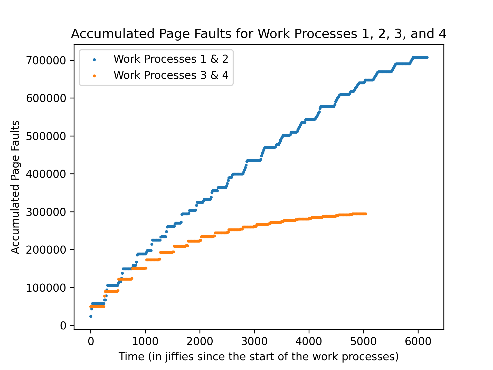
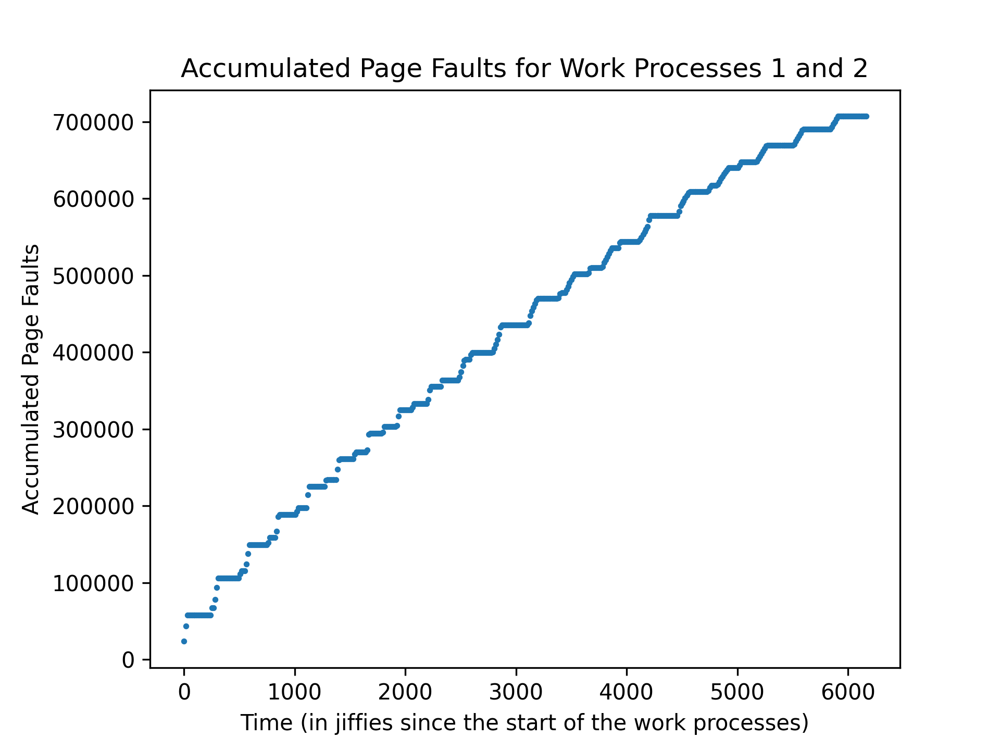
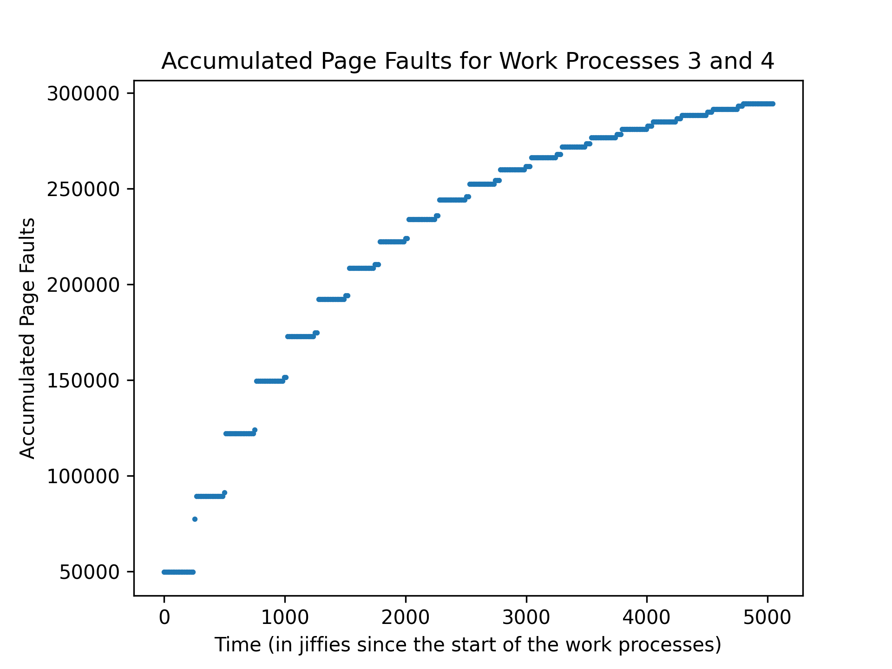
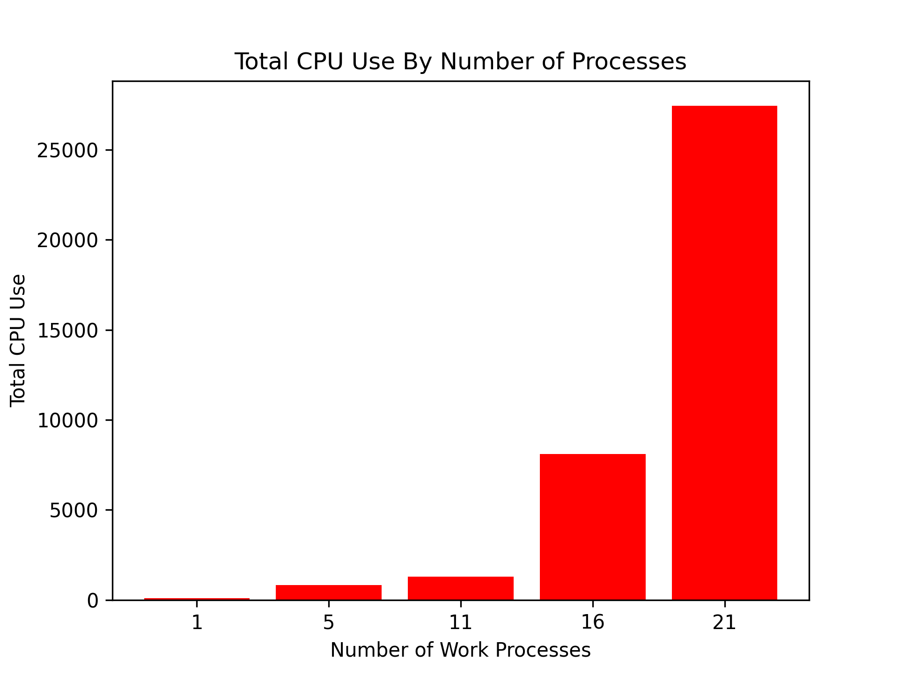
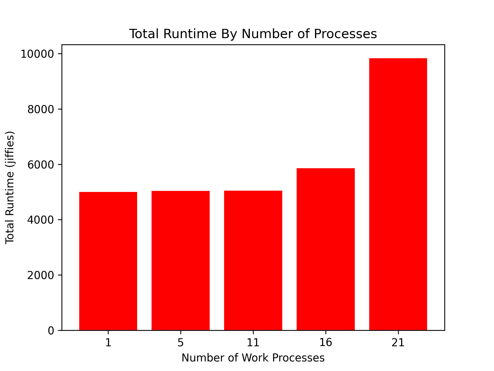

# Page Fault Profiler Linux Kernel Module

## Usage:

An application that wishes to use this page fault profiler must implement the
following callbacks to interact with the kernel module: 
* Application registration - Notify the module to monitor this application
* Application deregistration - Notify the module to remove the application from the module

## Example C Code

### Application Registration

```C++
char* buf = NULL;
FILE* f = fopen("/proc/mp3/status", "w");

asprintf(&buf, "R,%d", getpid());
fwrite(buf, strlen(buf), 1, f);
fclose(f); free(buf);
```

### Verifying that the Application Was Registered
```C++
int is_registered = 0; // initially false...
char *lineptr = NULL, *colon = NULL;
FILE *f = fopen("/proc/mp3/status", "r");
size_t buf_size = 0;

while ( getline(&lineptr, &buf_size, f) != EOF ) {
    lineptr[strlen(lineptr) - 1] = '\0';
    if ( atoi(lineptr) == getpid() ) {
        is_registered = 1; // this process is registered!
        break;
    }
}

free(lineptr); fclose(f);
// continue...
```

### Application Deregistration

```C++
char* buf = NULL;
FILE* f = fopen("/proc/mp3/status", "w");
asprintf(&buf, "U,%d", getpid());
fwrite(buf, strlen(buf), 1, f);
fclose(f); free(buf);
```

## Implementation

This module uses an entry in the proc filesystem to allow applications in the userspace to interact with it. Userspace applications can register and deregister using the protocol specified above as the module uses a single write callback to handle all kinds of interactions. Userspace applications can verify that they are registered by checking whether its pid is contained in the list of pids copied on a read to the proc filesystem entry. The module uses a read callback to support this. It also keeps track of all processes registered at any given instant with an internal linked list.

The module uses an internal delayed workqueue to periodically collect minor and major page faults and CPU utilization for all registered processes. Every 50 milliseconds, the module will sum the statistics for all registered processes and write them to a memory buffer. This memory buffer is exposed with a character device. Userspace processes can access this memory buffer by `mmap`ing the character device. This kernel module supports reads and writes to the character device, and thus the buffer, by implementing a custom page fault handler. When an access to a page in the character device generates a fault, the kernel module callback function will copy the memory in the buffer corresponding to the page requested to the userspace virtual memory. 

## Analysis

This data was collected on a VM with 3GB RAM and 2 CPU cores. 

### Case Study 1: Thrashing and Locality

This plot below combines the plots for work processes 1 & 2 and work processes 3 & 4. The individual plots are found below. 

The accumulated page fault count grows steadily when the 2 work processes use random locality access (indicated by the blue plot). When one of the processes uses locality-based access, the page fault count grows fast at the start, but tapers off as the program continues running (indicated by the orange plot). The 2 concurrent processes with both random locality access take longer to finish than the 2 concurrent processes where 1 process uses locality-based access. The CPU performs more overhead swapping pages for the 2 concurrent random locality access processes, so the time taken to finish the process is longer. The CPU does not need to perform as many swaps when using locality-based access, as discussed below. 

When both processes use random locality access, the CPU must continue to swap pages in and out of memory. The memory access is random, so pages used at some point in time will be eventually paged out. These pages might be requested again, so they must be paged back in at some later time. Thus, the CPU keeps consistent page fault accumulation counts throughout the runtime of the processes. 

When one process uses locality-based access, the CPU does not need to continue swapping pages in and out of memory since the access is local. By the definition of locality-based access, the process will perform all accesses of a particular memory region in one particular burst of time then move to another memory region. There is not as much of a need for page swapping.






### Case Study 2: Multiprogramming

Below are the plots of the CPU utilization and total time for completion for 1, 5, 11, 16, and 21 processes. There is a roughly exponential growth in CPU utilization as the number of concurrent processes increases. We observe an exponential growth since the kernel must take time to swap out pages as each process requests to access some memory. The CPU spends more overhead swapping pages in addition to handling the syscalls such for each process. There are not many swaps needed for 1, 5, and 11 processes since the memory required for these numbers of concurrent processes is below/nearing the memory limit imposed on the VM. The CPU must perform many more swaps for 16 and 21 processes since running that many passes the RAM limit imposed on the VM. 



We observe a minimal increase in the runtime for 16 processes and a large increase in the runtime of 21 concurrent processes. My VM begins to max out its RAM usage with 16 and 21 processes, so the CPU must perform many more page swaps from disk to RAM and vice versa. 


